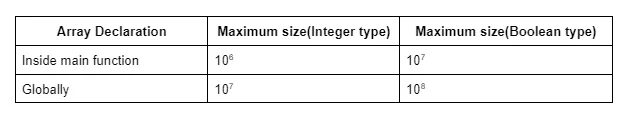

for maximum size of hash(array) you can declare is 

in main fuction i.e. psvm

10 ^ 6    int arr[10 ^ 6]

In Gobal level , more of like outside the main function

10 ^ 7  or 10 ^ 7 + 1 or 2 
Nearly about it 

int arr[10 ^ 7]

In order to optimize this approach, we need to use hashing. If we say the definition of hashing in a naive way,
it is nothing but the combination of the steps, pre-storing, and fetching.

Now, let’s understand how to solve the given problem using the two steps:
Assumption: We are assuming that the maximum element in the given array can be 12.

Step 1 – Pre-storing: In this step, we will create an array(named hash array) of 
size 13(so that we can get the index 12) initialized with 0. 
In this hash array, we are going to store the frequency of each element
(i.e. The number of times each element appears in the array) of the given array. 
To do so, we will iterate over the given array, and for each element arr[i], we will do hash[arr[i]] += 1.
After completing this process the hash array will look like the following:

This step is named pre-storing as we are pre-calculating the information about the element of the array before
answering the queries.

Step 2 – Fetching: In this step, we will select each query i.e. the number and for the query,
we will just fetch the value of hash[number] and return it instead of running a ‘for loop’ every time. 